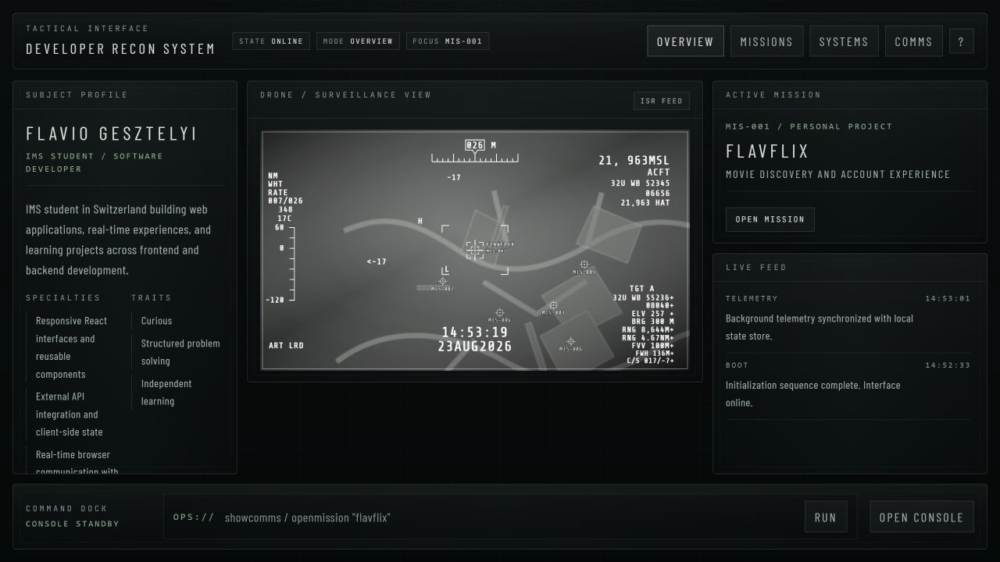

# Portfolio Command Center

An interactive, military-inspired portfolio, built to present real software projects through a command-center interface.

[](https://portfolio-fgn.vercel.app/)
[](https://github.com/im24a-gesztelyif/portfolio-command-center/actions/workflows/ci.yml)



## Implemented features

- Mission-style project browser backed by verified project data
- Interactive ISR-inspired project selector and mission dossiers
- Command terminal navigation and keyboard-friendly controls
- Capability overview based on technologies used in the linked repositories
- Responsive layouts, guided tutorial, boot sequence, and motion effects
- Direct links to every project's source repository

## Technology

- React 19 and TypeScript
- Vite
- React Router
- Tailwind CSS 4
- Framer Motion
- Zustand

## Architecture

Project content is stored as typed data in `src/data`, while reusable React components render the command-center navigation, project dossiers, capability panels, and terminal interactions. Zustand coordinates the small amount of shared interface state.

## Setup

```bash
npm install
npm run dev
```

Open the local URL printed by Vite.

## Configuration

No credentials are required. Repository and deployment links are defined alongside the verified project data in `src/data/missions.ts`.

## Verification

```bash
npm run lint
npm run build
```

The same checks run on GitHub Actions for pull requests and pushes to `main`.

## Project context

This is a personal learning portfolio. Its visual language is intentionally inspired by military command-center interfaces; the projects and technical claims are grounded in the linked source repositories.
